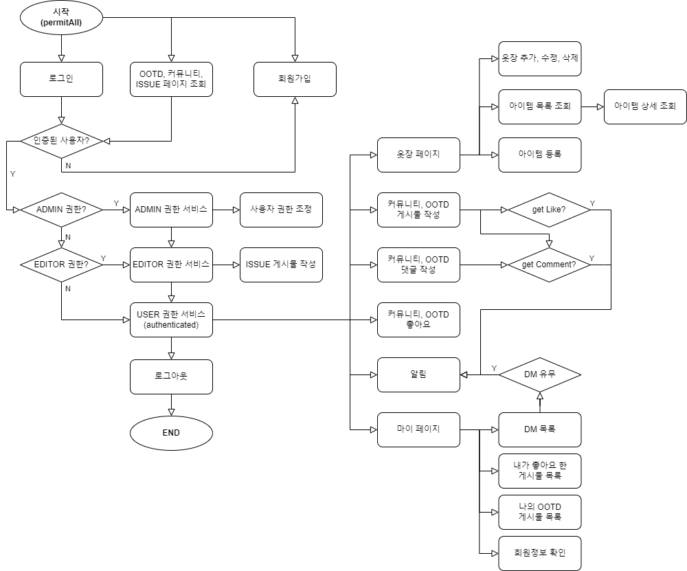
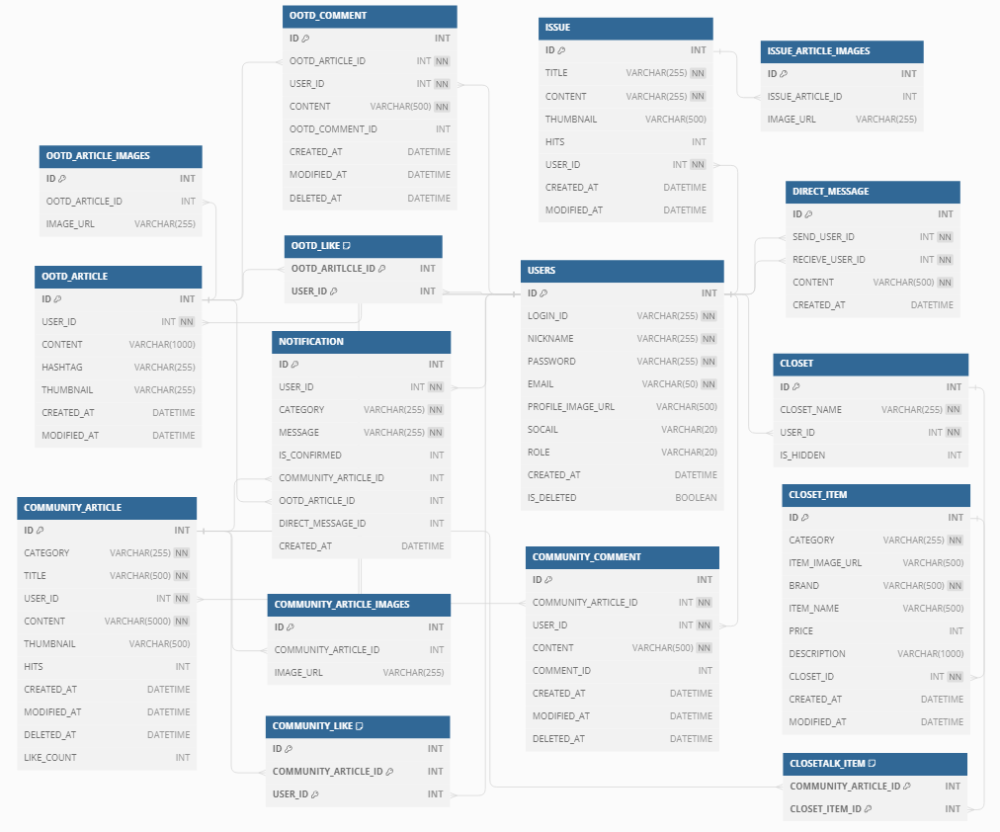
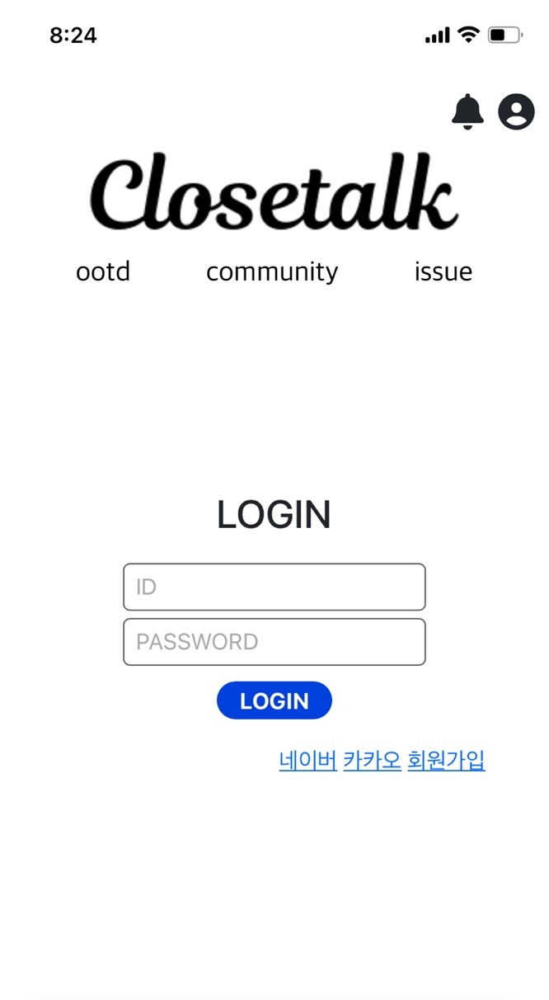
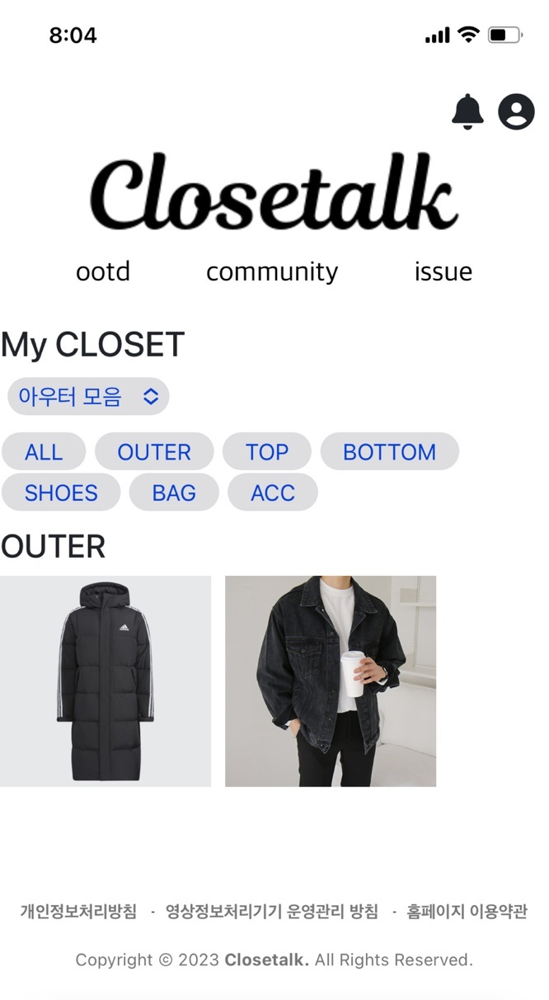
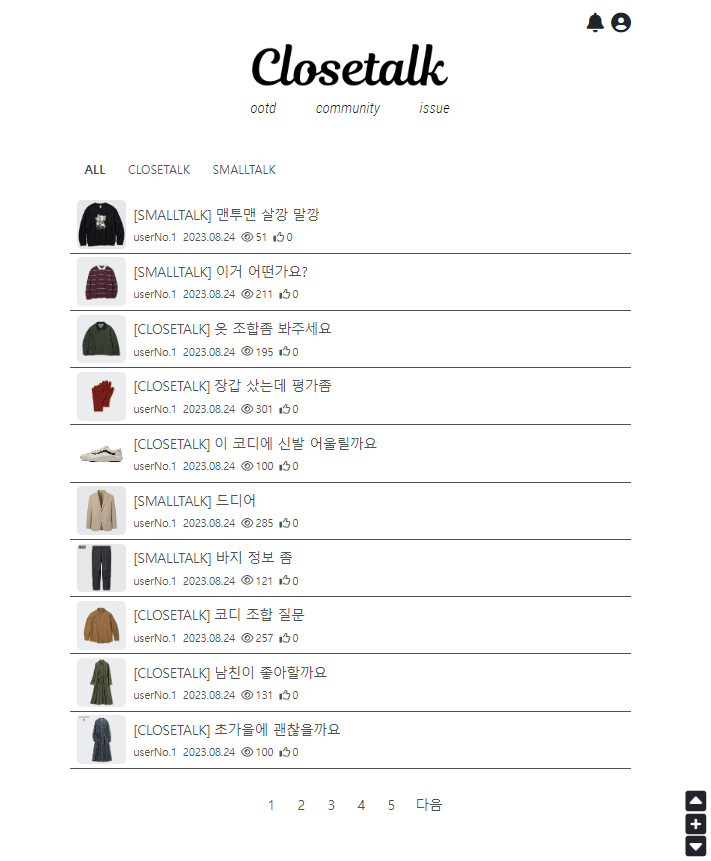
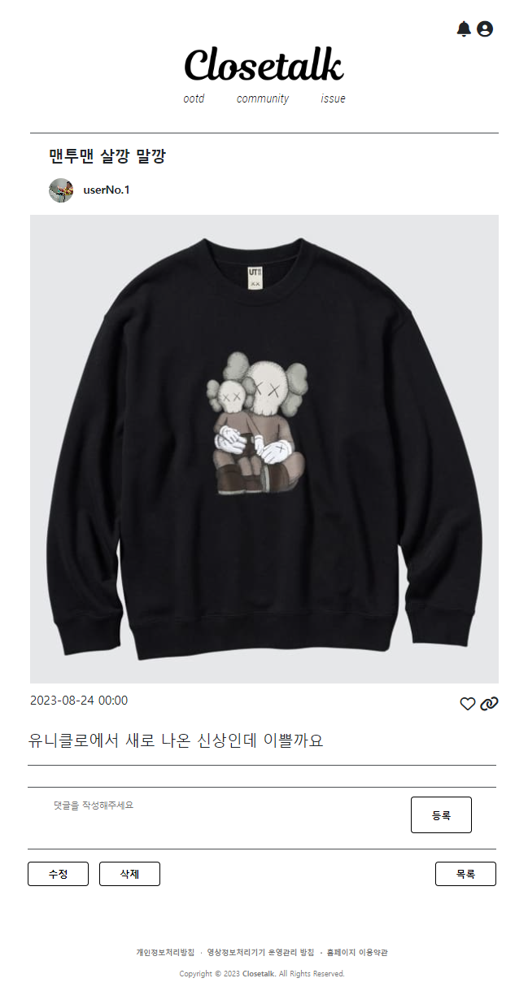
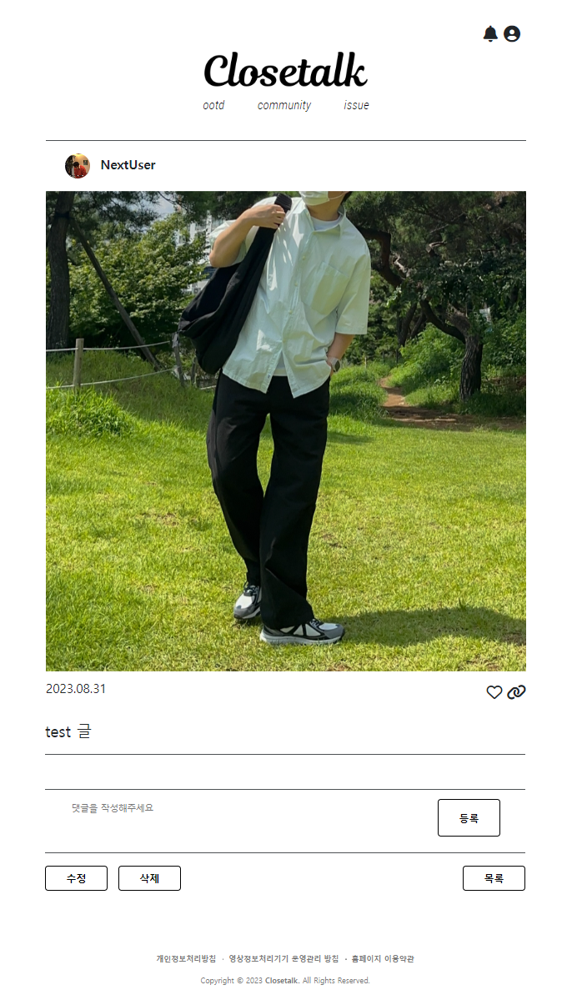
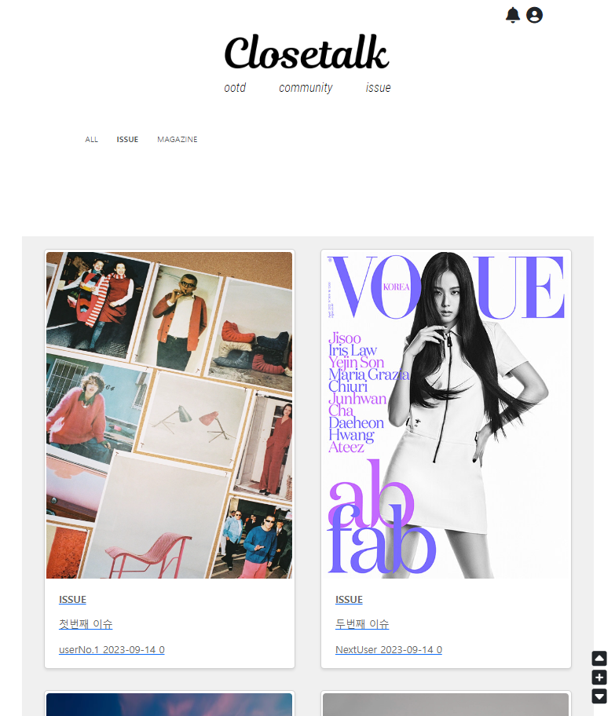

# CLOSETALK

**패션 스타일을 간단하게 커뮤니티 하나로, 패션에 대해 함께 나눌 수 있는 공간**

  

## 프로젝트 정보
|    분류     |                                              내용                                               |
|:---------:|:---------------------------------------------------------------------------------------------:|
|  **주제**   |                              자신만의 패션 스타일이나 패션 정보를 공유하는 커뮤니티 플랫폼                               |
| **제작 기간** |                                    2023.08.13 ~ 2023.09.14                                    |
| **배포 주소** | [CLOSETALK LINK](http://ec2-3-34-142-207.ap-northeast-2.compute.amazonaws.com:8080/loginPage) |

 

### 기획 배경
- 패션 트렌드의 빠른 변화로 인한 스타일링의 어려움
- 빠르게 패션 정보를 얻을 수 있는 공간 필요함
- 패션의 개인화에 따라 다양한 스타일을 공유하고 싶어함

### 기대 효과
- 개개인의 패션 스타일 발전
- 가상 옷장을 통한 심플한 소통
- 서로 패션을 공유하고 도와줌으로써 패션을 즐길 수 있음

  

## 팀원 소개
<table>
    <tbody>
        <tr>
            <td colspan="5" align="center"><b>김임김이나</b></td>
        </tr>
        <tr>
            <td align="center">임형택</td>
            <td align="center">김영섭</td>
            <td align="center">김민정</td>
            <td align="center">이광훈</td>
        </tr>
        <tr>
            <td align="center"><a href="https://github.com/Oh3gwnn">@Oh3gwnn</a></td>
            <td align="center"><a href="https://github.com/youngseobkim">@youngseobkim</a></td>
            <td align="center"><a href="https://github.com/bluelily555">@bluelily555</a></td>
            <td align="center"><a href="https://github.com/hunirin">@hunirin</a></td>
        </tr>
    </tbody>
</table>

  

## 기술 스택
|   분류   |                                                                                                                                                                                                                          기술 스택                                                                                                                                                                                                                          |
|:------:|:-------------------------------------------------------------------------------------------------------------------------------------------------------------------------------------------------------------------------------------------------------------------------------------------------------------------------------------------------------------------------------------------------------------------------------------------------------:|
| 개발 언어  |     |
| 프레임 워크 |                                                                                                         |
| 라이브러리  |                                                                                                                                                                                                                                         |
| 데이터베이스 |                                                                                                                                                                                                                                        |
|   배포   |                                                                                                                                                                                                                                   |
|  etc   |                   |
 

## Flow Chart

## ERD

### 요구사항 명세서

[**[PDF]** CLOSETALK 요구사항 명세서](https://drive.google.com/file/d/18u3Lt0JIaxdUg51ZdSHZO3DF7r6RET4U/view?usp=sharing)

  
 

## 주요 기능

 🔸 <b>회원가입 및 로그인</b>

        🔹 이메일 인증
        🔹 소셜 로그인

 🔸 <b>마이페이지</b>

        🔹 회원정보 - 수정/삭제
        🔹 DM - 전송/조회/삭제
        🔹 나의 OOTD - 내 글 조회

 🔸 <b>CLOSET</b>

        🔹 옷장 - 추가/수정/삭제
        🔹 아이템 등록
        🔹 아이템 조회/수정/삭제

 🔸 <b>COMMUNITY</b>

        🔹 게시글 목록 조회/검색/작성/수정/삭제/좋아요
        🔹 Closetalk - 옷장 연동 게시물
        🔹 Smalltalk - 일반 게시물 
        🔹 댓글 작성, 대댓글 작성

 🔸 <b>OOTD</b>

        🔹 게시글 목록 조회 - 무한스크롤 방식
        🔹 상단 배너 - 이슈/매거진 조회 스와이프형식
        🔹 게시글 조회/작성/수정/삭제/좋아요
        🔹 댓글 작성, 대댓글 작성

 🔸 <b>ISSUE</b>

        🔹 게시글 목록 조회
        🔹 게시글 조회/작성/수정/삭제/좋아요

 🔸 <b>DIRECT MESSAGE</b>

        🔹 DM 목록 조회 및 생성
        🔹 DM 조회 및 보내기

  

## 화면 구성

<table>
    <tbody>
        <tr>
            <td colspan="5" align="center"><b>Mobile</b></td>
        </tr>
        <tr>
            <td align="center"><b>LOGIN</b></td>
            <td align="center"><b>OOTD</b></td>
            <td align="center"><b>CLOSET</b></td>
        </tr>
        <tr>
            <td align="center"><b></b></td>
            <td align="center"><b></b></td>
            <td align="center"><b></b></td>
        </tr>
    </tbody>
</table>

 

<table>
    <tbody>
        <tr>
            <td colspan="5" align="center"><b>PC</b></td>
        </tr>
        <tr>
            <td align="center"><b>COMMUNITY</b></td>
            <td align="center"><b>COMMUNITY : Closetalk details</b></td>
        </tr>
        <tr>
            <td align="center"><b></b></td>
            <td align="center"><b></b></td>
        </tr>
        <tr>
            <td align="center"><b>COMMUNITY : Smalltalk details</b></td>
            <td align="center"><b>OOTD details</b></td>
        </tr>
        <tr>
            <td align="center"><b></b></td>
            <td align="center"><b></b></td>
        </tr>
        <tr>
            <td align="center"><b>ISSUE</b></td>
        </tr>
        <tr>
            <td align="center"><b></b></td>
        </tr>
    </tbody>
</table>

  

## REST API
